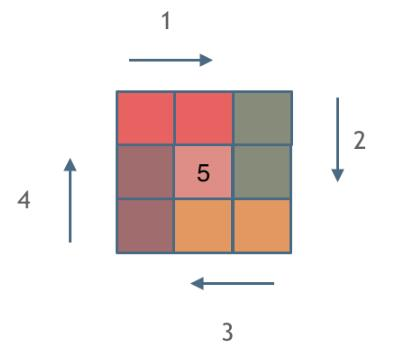

>


---

### 例1.[螺旋矩阵 II（59）-medium](https://leetcode.cn/problems/spiral-matrix-ii/)

#### 题目：
给你一个正整数 n ，生成一个包含 1 到 n2 所有元素，且元素按顺时针顺序螺旋排列的 n x n 正方形矩阵 matrix 。

示例1：  

```
输入：n = 3
输出：[[1,2,3],[8,9,4],[7,6,5]]
```

示例2：
```
输入：n = 1
输出：[[1]]
```

提示：

- 1 <= n <= 20

#### 思路：
绘制螺旋矩阵的思路就是依次循环绘制矩阵的四条边，需要注意每条边的边界条件，这里采用**左闭右开**原则：  


#### 解法：
观察可知：对于正整数 n,需要绘制四条边共 Math.floor(n+1/2) 次；

#### 代码：

<!-- tabs:start -->

#### **JavaScript**

```javascript
/**
 * @param {number} n
 * @return {number[][]}
 */
var generateMatrix = function(n) {
    //需要画loop次圈，每圈四条边，每一圈都从（startX,startY开始画）,每条边都坚持左闭右开的原则
    //初始化一个全为0的二维数组
    const a = new Array(n).fill(0).map(v => new Array(n).fill(0));
    
    let startX = startY = 0;
    //初始化填充的元素
    let x = 1;
    //定义需要遍历的圈数以及基数时中间位置的元素
    let loop = mid = Math.floor(n/2);
    //初始化每条边需要减的长度
    let offset = 1;
    if(n == 1) return [[1]];
    while(loop--){
        let i = startX;let j = startY;
        //第一圈，从矩阵左上角元素开始
        for(;j<startX+n-offset;j++){
            a[i][j]=x++;
        }
        //第二圈，从矩阵右上角元素开始
        for(;i<startY+n-offset;i++){
            a[i][j]=x++;
        }
        //第三圈，从矩阵右下角元素开始
        for(;j>startY;j--){
            a[i][j]=x++;
        }
        for(;i>startX;i--){
            a[i][j]=x++;
        }
        startX++;
        startY++;
        offset+=2;
    }
    //n为奇数需要单独给它赋值
    if(n%2==1){
        a[mid][mid]=x;
    }
    return a;
};
```

#### **Java**

```
System.out.println("Hello World");
```

#### **Python**

```
print('Hello World')
```

<!-- tabs:end -->

---