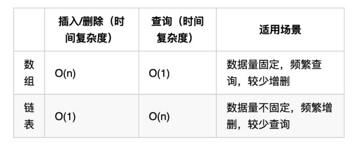

>


---

#### 链表理论基础


#### 1. 特点

- 查找和修改（不适合）：需要从头遍历到该元素。

- 插入和删除（适合）：只需要修改邻近的指针

如图：  



#### 2. 链表的定义

#### 代码：

<!-- tabs:start -->

#### **JavaScript**

```javascript
function ListNode(val, next) {
      this.val = (val===undefined ? 0 : val)
      this.next = (next===undefined ? null : next)
}
```

#### **Java**

```
public class ListNode {
    // 结点的值
    int val;

    // 下一个结点
    ListNode next;

    // 节点的构造函数(无参)
    public ListNode() {
    }

    // 节点的构造函数(有一个参数)
    public ListNode(int val) {
        this.val = val;
    }

    // 节点的构造函数(有两个参数)
    public ListNode(int val, ListNode next) {
        this.val = val;
        this.next = next;
    }
}
```

#### **Python**

```
class ListNode:
    def __init__(self, val, next=None):
        self.val = val
        self.next = next
```

<!-- tabs:end -->

>   参考链接：[二分查找-代码随想录](https://programmercarl.com/%E9%93%BE%E8%A1%A8%E7%90%86%E8%AE%BA%E5%9F%BA%E7%A1%80.html#%E6%B7%BB%E5%8A%A0%E8%8A%82%E7%82%B9)(参考链接)


