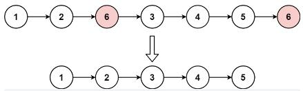

>


---

### 例1.[移除链表元素（203）-easy](https://leetcode.cn/problems/remove-linked-list-elements/)

#### 题目：
给你一个链表的头节点 head 和一个整数 val ，请你删除链表中所有满足 Node.val == val 的节点，并返回新的头节点。

示例1：

```
输入：head = [1,2,6,3,4,5,6], val = 6
输出：[1,2,3,4,5]
```

示例2：
```
输入：head = [], val = 1
输出：[]
```

示例3：
```
输入：head = [7,7,7,7], val = 7
输出：[]
```

提示：

- 列表中的节点数目在范围 [0, 10的4次方] 内
- 1 <= Node.val <= 50
- 0 <= val <= 50

#### 思路：

直接遍历链表删除元素即可，需要注意当删除首尾节点的情况。  
因此采用设置**虚拟头节点** res 的方式进行操作，最后返回值为虚拟节点的 res.next 即可。

#### 解法：


#### 代码：

<!-- tabs:start -->

#### **JavaScript**

```javascript
/**
 * Definition for singly-linked list.
 * function ListNode(val, next) {
 *     this.val = (val===undefined ? 0 : val)
 *     this.next = (next===undefined ? null : next)
 * }
 */
/**
 * @param {ListNode} head
 * @param {number} val
 * @return {ListNode}
 */
var removeElements = function(head, val) {
    //创建虚拟头节点
    const res = new ListNode(0,head);
    //定义个cur节点来遍历链表
    let cur = res;
    //循环条件是cur节点存在下个节点
    while(cur.next){
        //判定cur的下一节点数据域是否是val
        if(cur.next.val===val){
            cur.next = cur.next.next;
            continue;
        }
        cur = cur.next;
    }
    //返回的是新链表的头节点
    return res.next;
};
```

#### **Java**

```
System.out.println("Hello World");
```

#### **Python**

```
print('Hello World')
```

<!-- tabs:end -->

---