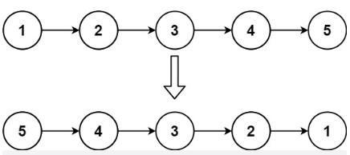
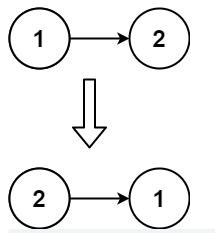

>


---

### 例1.[反转链表（206）-easy](https://leetcode.cn/problems/reverse-linked-list/)

#### 题目：
给你单链表的头节点 head ，请你反转链表，并返回反转后的链表。

示例1：

```
输入：head = [1,2,3,4,5]
输出：[5,4,3,2,1]
```
示例2：

```
输入：head = [1,2]
输出：[2,1]
```

示例3：
```
输入：head = []
输出：[]
```

提示：

- 链表中节点的数目范围是 [0, 5000]
- -5000 <= Node.val <= 5000

#### 思路：
不用定义新链表，只需依次改变每个节点的指针指向即可。（双指针）

#### 解法：
1. 迭代法：
- 定义两个节点指针，一个指向 null （注意不是定义虚拟头节点），一个指向头节点。
- 每次先定义临时指针保存右指针的位置，然后把右指针的下一个节点指向左指针，然后把左指针赋给右指针，右指针赋给临时指针，依次循环。
- 写循环结束条件时使用一个特殊情况和普通情况分别验证。  
> 注意：是否需要定义虚拟头节点需要视情况而定。这里如果定义虚拟头节点，则翻转后需要虚拟节点需要删除，因此只需定义空节点即可。

2. 递归法：
- 思想不同但语法上和迭代法相似，理论上两种方法可以互相转换，具体见代码。

#### 代码：

<!-- tabs:start -->

#### **JavaScript**

```javascript
/**
 * Definition for singly-linked list.
 * function ListNode(val, next) {
 *     this.val = (val===undefined ? 0 : val)
 *     this.next = (next===undefined ? null : next)
 * }
 */
/**
 * @param {ListNode} head
 * @return {ListNode}
 */
//1.迭代法
var reverseList = function(head) {
    if(!head || !head.next){
        return head;
    }
    let left = null;
    let right = head;
    while(right){
        let temp = right.next;
        right.next = left;
        left = right;
        right = temp;
    }
    return left;
};
//2.递归法
var reverseList = function(head) {
    //设定好递归函数的参数(left,right),初始化为null和head
    return reverse(null,head);
};
var reverse = function(left,right){
    //确定函数的出口，迭代法中为循环条件
    if(!right){
        return left;
    }
    //递归的基本操作，迭代法中为循环中的语句
    let temp = right.next;
    right.next = left;
    left = right;
    right= temp;
    //注意下次迭代输入参数的更新
    return reverse(left,right);
}
```

#### **Java**

```
System.out.println("Hello World");
```

#### **Python**

```
print('Hello World')
```

<!-- tabs:end -->

---