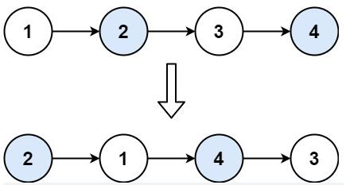
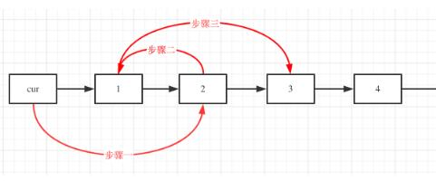

>


---

### 例1.[两两交换链表节点（24）-medium](https://leetcode.cn/problems/swap-nodes-in-pairs/)

#### 题目：
给你一个链表，两两交换其中相邻的节点，并返回交换后链表的头节点。你必须在不修改节点内部的值的情况下完成本题（即，只能进行节点交换）。

示例1：

```
输入：head = [1,2,3,4]
输出：[2,1,4,3]
```
示例2：
```
输入：head = []
输出：[]
```

示例3：
```
输入：head = [1]
输出：[1]
```

提示：

- 链表中节点的数目在范围 [0, 100] 内
- 0 <= Node.val <= 100

#### 思路：
定义虚拟头节点和遍历节点（cur或temp），挨个将遍历节点后方两个节点交换即可。  
- 重点在于**循环条件的选取**和交换后**遍历节点的更新**。（遍历节点的选取对其更新难易程度十分重要）

具体操作如下：（步骤顺序视情况而定，注意遍历节点指向的更新）



#### 解法：

见代码。

#### 代码：

<!-- tabs:start -->

#### **JavaScript**

```javascript
/**
 * Definition for singly-linked list.
 * function ListNode(val, next) {
 *     this.val = (val===undefined ? 0 : val)
 *     this.next = (next===undefined ? null : next)
 * }
 */
/**
 * @param {ListNode} head
 * @return {ListNode}
 */
//解答思路来自代码随想录，该题后面还需多回顾
var swapPairs = function(head) {
    //定义虚拟头节点用来返回链表
    let res = new ListNode(0,head);
    //定义temp节点代表两个节点的前一位置，方便后面赋值
    let temp = res;
    //每次循环前判定后面是否还有两个节点
    while(temp.next&&temp.next.next){
        let left = temp.next;
        let right = temp.next.next;
        //开始交换节点，并把temp指向前面节点
        //这里直接把后面节点地址获取，减少定义指针
        left.next = right.next;
        right.next = left;
        temp.next = right;
        //交换完成，将temp后移两节点
        temp = left;
    }
    return res.next;
};
```

#### **Java**

```
System.out.println("Hello World");
```

#### **Python**

```
print('Hello World')
```

<!-- tabs:end -->

---