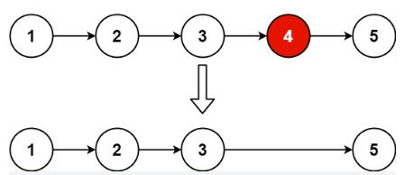

>


---

### 例1.[删除链表的倒数第 N 个结点（19）-medium](https://leetcode.cn/problems/remove-nth-node-from-end-of-list/)

#### 题目：
给你一个链表，删除链表的倒数第 n 个结点，并且返回链表的头结点。

示例1：

```
输入：head = [1,2,3,4,5], n = 2
输出：[1,2,3,5]
```
示例2：
```
输入：head = [1], n = 1
输出：[]
```

示例3：
```
输入：head = [1,2], n = 1
输出：[1]
```

提示：

- 链表中结点的数目为 sz
- 1 <= sz <= 30
- 0 <= Node.val <= 100
- 1 <= n <= sz

#### 思路：
快慢指针的经典应用：找倒数第n节点。通过快慢指针，先让快指针移动n步，再让快指针和慢指针一起移动，直到快指针移动到末尾。
- 这样快指针移动了n步和len-n步，慢指针移动了len-n步，慢指针的位置正好是倒数第n节点位置。

#### 解法：

见代码。

#### 代码：

<!-- tabs:start -->

#### **JavaScript**

```javascript
/**
 * Definition for singly-linked list.
 * function ListNode(val, next) {
 *     this.val = (val===undefined ? 0 : val)
 *     this.next = (next===undefined ? null : next)
 * }
 */
/**
 * @param {ListNode} head
 * @param {number} n
 * @return {ListNode}
 */
var removeNthFromEnd = function(head, n) {
    let res = new ListNode(0,head);
    let fast = slow = res;
    //循环条件为快指针存在下一节点；移动到第n节点慢指针也开始移动
    while(fast.next){
        fast = fast.next;
        if(n<=0){
            slow=slow.next;
        }
        n--;
    }
    slow.next = slow.next.next;
    return res.next;
};
```

#### **Java**

```
System.out.println("Hello World");
```

#### **Python**

```
print('Hello World')
```

<!-- tabs:end -->

---