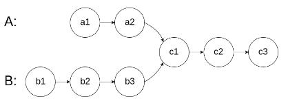
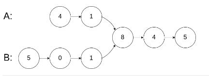
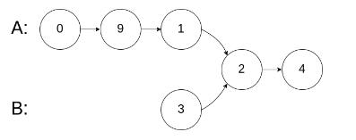
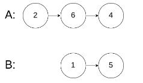

>


---

### 例1.[面试题 02.07. 链表相交 -easy](https://leetcode.cn/problems/intersection-of-two-linked-lists-lcci/)

#### 题目：
给你两个单链表的头节点 headA 和 headB ，请你找出并返回两个单链表相交的起始节点。如果两个链表没有交点，返回 null .  
图示两个链表在节点 c1 开始相交：  
  

题目数据 保证 整个链式结构中不存在环。  
注意，函数返回结果后，链表必须 保持其原始结构 。  

示例1：  

```
输入：intersectVal = 8, listA = [4,1,8,4,5], listB = [5,0,1,8,4,5], skipA = 2, skipB = 3
输出：Intersected at '8'
解释：相交节点的值为 8 （注意，如果两个链表相交则不能为 0）。
从各自的表头开始算起，链表 A 为 [4,1,8,4,5]，链表 B 为 [5,0,1,8,4,5]。
在 A 中，相交节点前有 2 个节点；在 B 中，相交节点前有 3 个节点。
```
示例2：  

```
输入：intersectVal = 2, listA = [0,9,1,2,4], listB = [3,2,4], skipA = 3, skipB = 1
输出：Intersected at '2'
解释：相交节点的值为 2 （注意，如果两个链表相交则不能为 0）。
从各自的表头开始算起，链表 A 为 [0,9,1,2,4]，链表 B 为 [3,2,4]。
在 A 中，相交节点前有 3 个节点；在 B 中，相交节点前有 1 个节点。
```

示例3：  

```
输入：intersectVal = 0, listA = [2,6,4], listB = [1,5], skipA = 3, skipB = 2
输出：null
解释：从各自的表头开始算起，链表 A 为 [2,6,4]，链表 B 为 [1,5]。
由于这两个链表不相交，所以 intersectVal 必须为 0，而 skipA 和 skipB 可以是任意值。
这两个链表不相交，因此返回 null 。
```

提示：

- listA 中节点数目为 m
- listB 中节点数目为 n
- 0 <= m, n <= 3 * 10的4次方
- 1 <= Node.val <= 10的5次方
- 0 <= skipA <= m
- 0 <= skipB <= n
- 如果 listA 和 listB 没有交点，intersectVal 为 0
- 如果 listA 和 listB 有交点，intersectVal == listA[skipA + 1] == listB[skipB + 1]

#### 思路：
- 根据图示，得出链表相交后的剩余长度是相等的。
- 因此先分别遍历链表得到长度，再让较长的链表移动多出来的节点，最后同时移动两个链表并挨个比较即可。

#### 解法：

见代码。

#### 代码：

<!-- tabs:start -->

#### **JavaScript**

```javascript
/**
 * Definition for singly-linked list.
 * function ListNode(val) {
 *     this.val = val;
 *     this.next = null;
 * }
 */

/**
 * @param {ListNode} headA
 * @param {ListNode} headB
 * @return {ListNode}
 */
//封装获得链表节点个数的函数
var getLen = function (head){
    let index = 0;
    let cur = new ListNode(0,head);
    while(cur.next){
        cur = cur.next;
        index++;
    }
    return index;
}
var getIntersectionNode = function(headA, headB) {
    //无特殊情况下，通通使用虚拟头节点，防止出现一些特殊情况
    let curA = new ListNode(0,headA);
    let curB = new ListNode(0,headB);
    //先遍历两个链表得到其长度
    const lenA = getLen(headA);
    const lenB = getLen(headB);
    if(!lenA || !lenB) return null;
    //A长就把A移到A多出的位置;B同理
    if(lenA >= lenB){
        let diff = lenA - lenB;
        while(diff--){
            curA = curA.next;
        }
    }else{
        let diff = lenB - lenA;
        while(diff--){
            curB = curB.next;
        }
    }
    //A、B同时开始移动，直到A、B下个节点相等
    while(curA.next){
        if(curA.next==curB.next){
            return curA.next;
        }
        curA = curA.next;
        curB = curB.next;
    }
    return null;
};
```

#### **Java**

```
System.out.println("Hello World");
```

#### **Python**

```
print('Hello World')
```

<!-- tabs:end -->

---