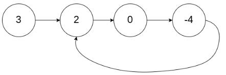
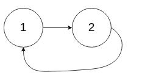
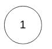
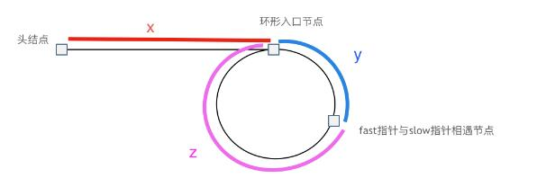

>


---

### 例1.[环形链表 II（142）-medium](https://leetcode.cn/problems/linked-list-cycle-ii/)

#### 题目：
给定一个链表的头节点  head ，返回链表开始入环的第一个节点。 如果链表无环，则返回 null。

如果链表中有某个节点，可以通过连续跟踪 next 指针再次到达，则链表中存在环。 为了表示给定链表中的环，评测系统内部使用整数 pos 来表示链表尾连接到链表中的位置（索引从 0 开始）。如果 pos 是 -1，则在该链表中没有环。注意：pos 不作为参数进行传递，仅仅是为了标识链表的实际情况。

不允许修改链表。

示例1：  

```
输入：head = [3,2,0,-4], pos = 1
输出：返回索引为 1 的链表节点
解释：链表中有一个环，其尾部连接到第二个节点。
```
示例2：  

```
输入：head = [1,2], pos = 0
输出：返回索引为 0 的链表节点
解释：链表中有一个环，其尾部连接到第一个节点。
```

示例3：  

```
输入：head = [1], pos = -1
输出：返回 null
解释：链表中没有环。
```

提示：

- 链表中节点的数目范围在范围 [0, 10的4次方] 内
- -10的5次方 <= Node.val <= 10的5次方
- pos 的值为 -1 或者链表中的一个有效索引

#### 思路：
这题一开始看没什么思路。直接看解答，**快慢指针法**:
- 判定有环：快指针每次移动两个节点，慢指针移动一个节点，若有环则一定会在环中相遇。如图所示：  
   
- 找出入口节点：设入口节点长 x，入口节点至相遇节点长 y，相遇节点回至入口节点长 z，如图所示：  

  

由图可知，慢指针走过了 x+y，快指针走过了 x+n(y+z)+y .（快指针转了 n 圈才刚好遇到慢指针）  
则：`2(x+y) = x+n(y+z)+y`,化简后得出入口节点 `x = (n-1)(y+z)+z`.  
当 n = 1 时，x = z .说明头节点和相遇节点同时出发会在入口节点相遇。  
当 n > 1 时，说明相遇节点比头节点多转了 (n-1) 圈，最后仍在入口节点相遇。

#### 解法：

分两步：
1. 找出相遇节点：第一次循环，让fast和slow相遇（fast走两步slow走一步）  
若不相遇则返回 null.
2. 找出入口节点：第二次循环，慢指针从虚拟头节点开始，fast从相遇节点开始（都走一步，相等处为入口节点）

#### 代码：

<!-- tabs:start -->

#### **JavaScript**

```javascript
/**
 * Definition for singly-linked list.
 * function ListNode(val) {
 *     this.val = val;
 *     this.next = null;
 * }
 */

/**
 * @param {ListNode} head
 * @return {ListNode}
 */
var detectCycle = function(head) {
    if(!head || !head.next){
        return null;
    }
    let res = new ListNode(0,head);
    let fast = slow = res;
    //1.先找到相遇节点，不用定义最后slow和fast都是（注意循环条件）
    while(fast.next && fast.next.next){
        slow = slow.next;
        fast = fast.next.next;
        if(slow == fast){
            break;
        }
    }
    if(slow != fast)  return null;//没相遇，无环
    //2.再找入口节点：慢指针从虚拟头节点出发;快指针从相遇节点出发
    //快慢指针相遇之处即为入口节点
    slow = res;
    while(slow != fast){
        slow = slow.next;
        fast = fast.next;
    }
    return slow;
};
```

#### **Java**

```
System.out.println("Hello World");
```

#### **Python**

```
print('Hello World')
```

<!-- tabs:end -->

---