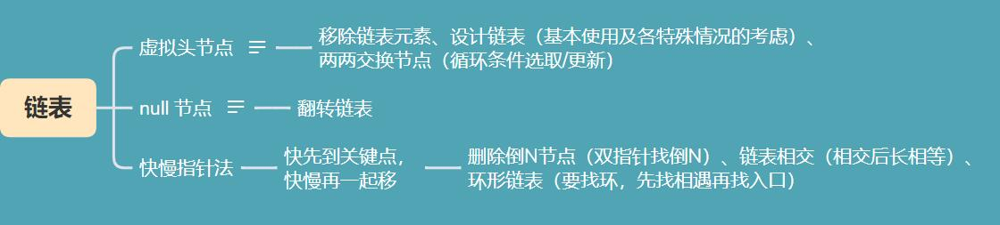

# 链表总结

#### 1.Skills

虚拟头节点 or null节点？
- 是否需要定义虚拟头节点取决于遍历完成后**是否需要得到头节点地址**。
- null 节点为一种遍历后不易去除虚拟头节点的替代方法（如翻转链表）

通常需要定义几个节点指针？
- 两个。一个用于保存头节点地址，一个用于遍历整个链表。

#### 2.overview

重点：
- `虚拟头节点` 和 `null节点` 的使用
- `链表的基本操作` 及 各`特殊情况`的考虑
- 快慢指针法在链表中的使用：`快先到关键点，快慢再一起移`  

如图：  

