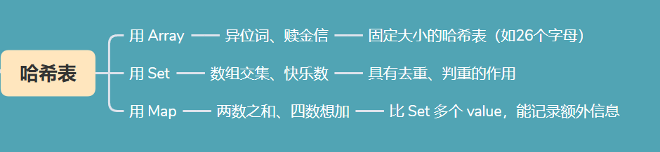

# 哈希表总结

#### 1.Skills
Array、Set、Map 都可以用来做哈希表，如何选择？
- 见图。

两数之和、四数相加 这类题的通用思路是什么？
- 先找等式，左右为两组，左边元素一起创建为 map ，再扫描右边元素看 map 中是否有满足条件的元素

#### 2.overview

重点：
- `Array`、`Set`、`Map` 的创建、自带方法以及作为哈希表的使用

如图：  

