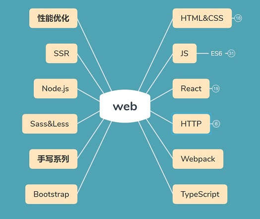

# Overview

> 该文档用于记录前端常见问题,在线访问地址：https://mrgong1997.github.io/Q-A/#/

## 一.说明

文档由基本的 **Q&A** 项组成，一个 **Q&A** 项包含的基本结构如下：

<!-- 问题用三级标题，答案用四级标题 -->
<!-- *****************COPY************************ -->
### 1.今天中午吃什么（问题）  

---

#### Answer：

红烧鱼（参考回答 - 普通文本）
1. 鸭腿饭
2. 香辣鸭
3. 肉沫茄子（参考回答 - 列表文本） 

（参考回答 - 图片）  

```javascript
console.log('红烧鱼')
``` 
（参考回答 - 代码） 

<!-- tabs:start -->

#### **JavaScript**

```javascript
console.log('Hello World');
```

#### **Java**

```
System.out.println("Hello World");
```

#### **Python**

```
print('Hello World')
```

<!-- tabs:end -->
(参考回答 - 选项卡)

>   参考链接：[北区“美”食推荐](https://github.com/mrgong1997)(参考链接)
<!-- *****************COPY************************ -->
---

## 二.思维导图




