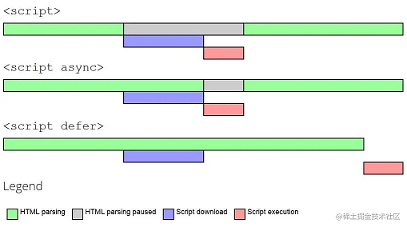

>

### 1.对HTML5语义化的理解

---

#### Answer：

语义化指的是根据内容的语义选择合适的标签。 

优点：  
- 对开发者友好。增加代码可读性。  

- 对机器友好。有利于 **SEO** (搜索引擎优化)；方便爬虫爬取有效信息；方便其它读屏软件解析。  

常见语义化标签：

```html
<header></header>  头部
<nav></nav>  导航栏
<section></section> 区块（有语义化的 div ）
<main></main>  主要区域
<article></article>  主要内容
<aside></aside>  侧边栏
<footer></footer>  底部

```

---
### 2.HTML5 有哪些更新

---

#### Answer：

1. 语义化标签（见Q1）  

2. 媒体标签（audio 音频、video 视频、source 视频源）  

3. DOM 查询操作（querySelector/All）  

4. Web 存储 （localStorage(无时间限制的存储)/sessionStorage（某session的存储））

5. history API（go、forward、back等）

6. canvas（画布）、Geolocation（地理定位）、websocket（通信协议）

---

### 3.src和href的区别
---

#### Answer：

相同：都是用来引用外部资源。  

不同：
- src：表示对资源的引用。src 会将其资源下载到文档内，且解析到此处时会**暂停**其他资源的处理，直到处理完毕。（如js脚本一般放页面底部）  

- href：表示对超文本引用。建立和本元素的链接关系，识别到此处时会**并行**处理，当前文档不会停止处理。（常用于 a、link 等标签）  

---

### 4.DOCTYPE (⽂档类型) 的作用
---

#### Answer：

告诉浏览器使用什么HTML规范来解析文档。

两种模式：
- 严格模式（CSS1Compat，默认）：浏览器使用 W3C 标准对页面进行解析。  

- 混杂模式（BackCompat）：浏览器按照自己的模式来解析。  

---

### 5.script 标签中 defer 和 async 的区别
---

#### Answer：

- script ：阻塞文档解析。该脚本 下载+执行 完后才会继续解析文档。   

- script async ：执行阶段阻塞文档。异步下载，成功后马上执行。  

- script defer ：不会阻塞文档。异步下载，整个解析完成后才执行该脚本。 

如图：



---

### 6.常用的 meta 标签有哪些 
---

#### Answer：

meta标签由 **name** 和 **content** 属性定义（类似 key/value），**用于描述网页文档属性**。

常用meta标签：

```html
charset 编码类型：
<meta charset="UTF-8" > 

keywords 页面关键词：
<meta name="keywords" content="keywords" /> 

description 页面描述：
<meta name="description" content="Description" /> 

refresh 页面重定向和刷新：
<meta http-equiv="refresh" content="0;url=" /> 

viewport 移动端适配，控制视口大小和比例：
<meta name="viewport" content="width=device-width, initial-scale=1, maximum-scale=1"> 

robots 搜索引擎索引方式：
<meta name="robots" content="index,follow" />
```

---
### 7.img标签中srcset属性的作用

---

#### Answer：

用于响应式布局中根据不同屏幕密度加载不同图片。 

```html
srcset 属性指定图片的地址和质量,sizes 属性通过媒体查询设置图片尺寸临界点：

<!-- 这里代表浏览器视口宽度为 360px 时图片宽度为 340px，其他情况为 128px -->
```

---
### 8.行内元素有哪些？块级元素有哪些？ 空(void)元素有那些？

---

#### Answer：

```html
行内元素：  
a  b  span  img  input  strong  

块级元素：  
div  ul/ol/li  p  h1~6  

空元素（无内容元素，标签不闭合）：  
<br>  <hr>    <input>  <link>  <meta>  
```

---

### 9.Canvas 和 SVG 的区别

---

#### Answer：

- Canvas: 画布，由JS绘制。依赖分辨率；不支持事件处理器；文本渲染能力弱（适合适合图像密集型游戏）
- SVG: 可缩放矢量图形，由XML描述。不依赖分辨率；支持时间处理器；适合渲染谷歌地图类的大型渲染区域的程序（不适合游戏应用）

---
### 10.HTML 中的 input 标签有哪些 type

---

#### Answer：

```html
button 按钮
checkbox 复选框
radio 单选按钮
Date 选择日期
file 选择文件
email 编辑邮箱
number 输入数字
text 输入文本
password 输入密码
submit 提交表单
reset 重置表单
```

---

### ------待更新---------

### 10. HTML5的离线储存怎么使用，它的工作原理是什么
### 11. 浏览器是如何对 HTML5 的离线储存资源进行管理和加载
### 12. title与h1的区别、b与strong的区别、i与em的区别？
### 13. iframe 有那些优点和缺点？
### 14. label 的作用是什么？如何使用？
### 15. 说一下 web worker
### 16. head 标签有什么作用，其中什么标签必不可少？
### 17. 浏览器乱码的原因是什么？如何解决？
### 18. 说一下 HTML5 drag API


>   参考链接：[「2021」高频前端面试题汇总之HTML篇 - 掘金](https://juejin.cn/post/6905294475539513352)
