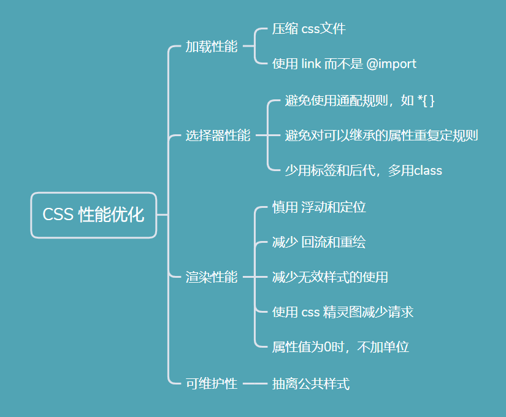
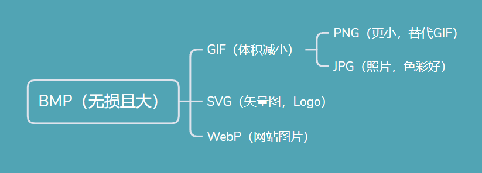
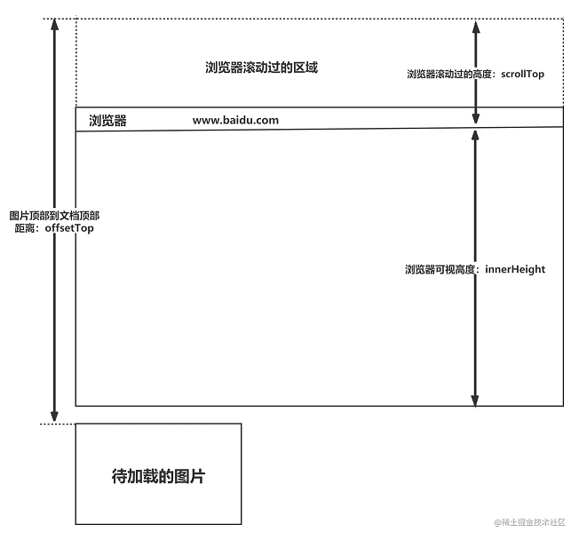

>
********高频********
---

---
### 1.CSS3 中有哪些新特性

---

#### Answer：

- 文字特效 （text-shadow）和文字渲染 （Text-decoration）
- 边框属性：圆角（border-radius）、阴影（box-shadow）、图片（border-image）
- 多列布局（multi-column layout）
- 渐变（gradient）
- 变换（transform）、过渡（transition）、动画（animation）

---

### 2.CSS 选择器的优先级

---

#### Answer：

!important > style 1000 > id 100 > class （属性、伪类）10 > 标签（伪元素） 1 > (后代选择器) 0

---

### 3.CSS 的盒模型

---

#### Answer：

标准盒模型（box-sizing: content-box）：宽高只包含 content  

替代盒模型（box-sizing: border-box）：宽高还包括padding 和 border

---

### 4.display 的 block、inline 和 inline-block 的区别

---

#### Answer：

block：独占一行可设置宽高  

inline：不独占一行不可设宽高（只能设置**水平**方向的 margin/padding）

inline-block：既不独占一行也可设置宽高 （两者优势结合）

---

### 5.display: none、visibility: hidden、opacity: 0 优劣和适用场景

---

#### Answer：

|        |  DOM |  事件监听  | 继承  | 性能  |
|  ----  | ----  | ----  | ----  | ----  |
| display: none  | 直接不渲染，因此不占空间 | 因此无法监听 | 更无法继承（根本无子元素） | 改变属性会导致重排，性能消耗大 |
| visibility: hidden  | 渲染但不可见，占空间 | 无法监听 | 子元素继承，且可通过改变属性取消隐藏 | 重绘，性能消耗较少 |
| opacity: 0  | 渲染但不可见，占空间 | 可以监听 | 子元素继承，不可通过改变属性取消隐藏 | 重绘，性能消耗较少 |

总结 摆烂层级：display: none （不渲染） > visibility: hidden(渲染不监听) > opacity: 0 (渲染且监听)  

其它隐藏元素的方法：  
- position: absolute + top 等；移出可视区域
- z-index:负值；被其他元素遮盖
- transform: scale(0,0)；把元素缩放至 0 实现隐藏

---

### 6.隐藏元素的方法有哪些

---

#### Answer：

上面三个方法加上：
- position:0 (利用绝对定位将元素移出可视区域)
- z-index:负值 (使该元素被其他元素遮盖)
- transform:scale(0,0) (将元素缩放至0) 

---


### 7. 实现单行、多行文本溢出隐藏

---

#### Answer：

- 单行文本溢出

```
<span>单行文本溢出处理，单文本溢出处理</span>
span {
      overflow: hidden;            // 溢出隐藏
      text-overflow: ellipsis;      // 溢出用省略号显示
      white-space: nowrap;         // 规定段落中的文本不进行换行
}

```

- 多行本文溢出

```
<span>多行文本溢出处理，多行文本溢出处理，多行文本溢出处理，多行文本溢出处理，多行文本溢出处理，</span>
span {
      overflow: hidden;            // 溢出隐藏
      text-overflow: ellipsis;     // 溢出用省略号显示
      display:-webkit-box;         // 作为弹性伸缩盒子模型显示。
      -webkit-box-orient:vertical; // 设置伸缩盒子的子元素排列方式：从上到下垂直排列(加前缀兼容浏览器)
      -webkit-line-clamp:3;        // 显示的行数(加前缀兼容浏览器)
}

```

---
### 8. CSS 性能优化的方法有哪些？

---

#### Answer：

如图：



---

********中频********
---

### 9.常见的图片格式及使用场景

---

#### Answer：

位图（点阵图/栅格图） & 矢量图：通过 **像素排列** 显示图像（缩放失真）；通过 **算法** 记录图像的形状及颜色显示图像（缩放失真）

直接色 & 索引色：像素数据 **直接表示颜色** ；像素数据指向 **索引号**（适合颜色少）

|        |  有/无损 |  像素表示  | 图像显示  |文件大小  | 适用场景  |
|  ----  | ----  | ----  | ----  | ----  | ----  |
| BMP  | 无损 | 直接+索引 | 位图 | 无压缩，较大 | 一般 |
| GIF  | 无损 | 索引色 | 位图 | 较小 | 色彩不高且体积较小 |
| PNG-8 与 PNG-24  | 无损 | 索引色 | 位图 | 相同效果比GIF更小 | GIF的替代品 |
| JPEG 与 JPG  | 有损 | 直接色 | 位图 | 相同效果比GIF大 | 照片，不适合Logo |
| SVG  | 无损 |  | 矢量图 | 小 | 适合绘制Logo、Icon |
| WebP  | 有损+无损 | | 位图 | 相同质量体积比其他都更小 | 网站图片，兼容性不够好 |


如图：  


---

### 10.CSS 中有哪些可继承与不可继承属性

---

#### Answer：

可继承：  
- 字体属性（font-xxx）
- 文本属性（text-align、letter-spacing、color）
- visibility 

不可继承：
- 盒模型属性（width、margin、padding、border 等）
- 定位属性 （display、float、top 等）
- 背景属性（background-xxx）

---

### 11.link 和 @import 的区别

---

#### Answer：

- 作用不同：link 可加载 css、rel 等多种属性；@import 只能加载 css  
- 加载顺序不同：link 和页面同时加载；@import 等页面加载完后才能加载  
- 兼容问题：link不存在兼容问题；@import 在 ie5 以上才兼容  

总结： link 优于 @import

---

### 12.对 CSS Sprites 的理解

---

#### Answer：

CSS Sprites：将一个页面的图片合并成一张大图，然后用background-image/repeat/position属性进行定位。

优点：减小网页请求。  
缺点：合并及开发需要时间，维护较麻烦。

---

### 13. 什么是物理像素，逻辑像素和像素密度，为什么移动端开发时要用@3x, @2x这种图片？

---

#### Answer：

- 物理像素：设备的真实像素。  
- 逻辑像素：写 CSS 时的 px 单位。

举例：比如 iPhone XS，我们写代码时，写的是其逻辑像素：414px * 896px；  
而该设备实际由 1242 * 2688 个物理像素组成，即 1 个逻辑像素 = 3 个物理像素，像素密度为3，这就是3倍屏。  
（因此显示 200x50 的图片需要 600x150 的尺寸，才能保证 1 个物理像素对应 1 个图片像素，使图片不失真）

使用理由：移动设备的屏幕尺寸小，像素密度高，不转换会导致字小不易阅读；  
高分屏可以使媒体资源的显示更加精细。

---
 
### 14. CSS 预处理器/后处理器是什么？

---

#### Answer：

- 预处理器：sass 和 less. 提供变量、循环、函数、混入等功能。   
- 后处理器：postCss. 实际上它是个 CSS 语法转换工具，类似 Javasrcipt 里的 Babel 编译器。本身作用为把 CSS 代码解析成抽象语法树，然后交给各种丰富的插件处理，如 Autoprefixer 插件通过自动添加前缀可以提升浏览器的兼容性。

---
 
### 15. 如何判断一个元素是否在可视区域内？

---

#### Answer：

**先了解几个概念**：
- window.innerHeight ：浏览器可视区的高度
- document.body.scrollTop || document.documentElement.scrollTop ：浏览器滚动的过的距离
- imgs.offsetTop ：元素顶部距离文档顶部的高度（包括滚动条的距离）
- imgs.height : 元素高度  



**在窗口上下滚动的情况下, 一个页面元素的状态有下面 3 种：**   
1. 还未滑动到可视区域（可视区域外）
2. 已经滚动到到可视区域上方（可视区域外）
3. 在可视区域内

第一种情况的高度：offsetTop > innerHeight + scrollTop  
第二种情况的高度：offsetTop + imgs.height < scrollTop  

因此：在可视区域的情况：  
scrollTop - imgs.height < offsetTop < innerHeight + scrollTop

**使用场景**：
图片的懒加载、列表的无限滚动等

---


>   参考链接：[「2021」高频前端面试题汇总之CSS篇 - 掘金](https://juejin.cn/post/6905539198107942919)