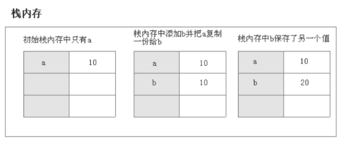
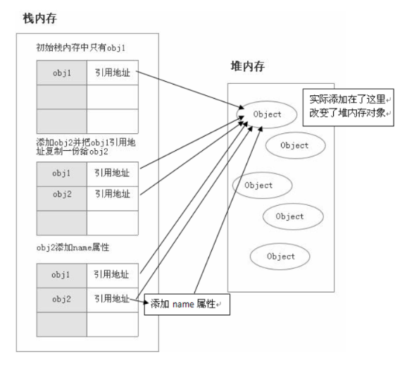

>
<!-- 5.16-5.22（一周） -->
### 1.JavaScript 有哪些数据类型，它们的区别？

---

#### Answer：
1. 种类：原始（5+2）+ 引用（1）

原始数据类型：（存储在栈中）   
- String Number Boolean null undefined + symbol(es6) bigInt(es10)  

引用数据类型：（存储在堆中）   
- Object（包含 function Date Array Set Map 等）

2. 区别：
- 原始数据类型：栈内存中一块连续的存储空间，占据空间小、大小固定。赋值操作（ b = a ）如图：  


- 引用数据类型：在堆内存中存放对象，还会在栈内存中存放指向该对象的地址，占据空间大、大小不固定。赋值操作（ obj2 = obj1 ），属于浅拷贝，更改 obj2 会改变 obj1 ，如图：  


---

### 2.数据类型检测的方式有哪些？

---

#### Answer：
1. typeof（只能判断原始类型,引用类型都被判定为 object ）  

```JavaScript
console.log(typeof "str");                //string
console.log(typeof 1);                    //number
console.log(typeof true);                 //boolean
console.log(typeof undefined);            //undefined
console.log(typeof null);                 //object (JS最初32位版本null和object类型标签相同所致)

console.log(typeof {});                   //object
```


2. instanceof （只能判断引用类型）   
底层原理为判定该对象是否能找到该构造函数的原型，即：  
判定 `arr.__proto__ == Array.prototype` 是否成立  

```JavaScript
console.log(2 instanceof Number);                // false
console.log(true instanceof Boolean);            // false 
console.log('str' instanceof String);            // false 
 
console.log([] instanceof Array);                // true
console.log(function(){} instanceof Function);   // true
console.log({} instanceof Object);               // true
```

3. constructor（都能判断）  

```JavaScript
console.log((2).constructor === Number);          // true
console.log((true).constructor === Boolean);      // true
console.log(('str').constructor === String);      // true

console.log(([]).constructor === Array);          // true
console.log((function() {}).constructor === Function); // true
console.log(({}).constructor === Object);         // true
```

4. Object.prototype.toString.call() （都能判断）    
通过调用 Object 对象的原型方法 toString 来判断:  

```JavaScript
Object.prototype.toString.call(2);        // [object Number]
Object.prototype.toString.call(true);     // [object Boolean]
Object.prototype.toString.call('str');    // [object String]
Object.prototype.toString.call(undefined);// [object Undefined]
Object.prototype.toString.call(null);     // [object Null]

Object.prototype.toString.call([]);       // [object Array]
Object.prototype.toString.call(function(){});// [object Function]
Object.prototype.toString.call({});       // [object Object]
```

---
### 3.判断一个对象为数组的方式有哪些？

---

#### Answer：
除了上面三个可以判定引用类型的方法`constructor`、`instanceof`、`Object.prototype.toString.call()`，还有：  

`Array.isArray([1,2])` ：ES5 新增方法  
`Array.prototype.isPrototypeOf([1,2])` ：判定 Array 是否在 该对象的原型链中  

---

### 4. null 和 undefined 区别 ？

---

#### Answer：
undefined ：代表变量未定义、赋值 / 变量提升  
null ：代表空对象，复制给可能会返回对象的变量作为初始化  
  
注意：  
```JavaScript
null == undefined;        //true 
null === undefined;       //false
```

---

### 5. " == " 和 " === " 的区别？以及 Object.is()  ？

---

#### Answer：
- " == "  

先判断左右两边数据类型是否相同，不同会先进行 **强制类型转换** ： 

若比较两个原始类型，则 String 和 Boolean 都会转换成 `Number`，再比较；（特例：null == undefined）  
若比较原始类型和引用类型，则会把`对象`转换成其`原始类型的值`，再比较；  
若比较两个引用类型，则会判断他们`是否指向同一个对象`；  
若存在 NaN，则不相等。  

- " === "

两个操作数类型不转换的前提下相等才返回 true.

- "Object.is()"

一般和 "===" 大致相同，处理了一些特殊情况，如 +0 和 -0 相等；NaN 和 NaN 相等。

---

### 6. 为什么 0.1 + 0.2 ! == 0.3 ？如何相等？

---

#### Answer：
因为某些浮点数在计算过程中会发生精度丢失。  
- 先说明双精度（64bit）浮点数的存储过程：  
浮点数（如 3.25）-> 二进制（11.01，整数位除二取余，小数位乘二取整） -> 科学计数法（1.101*2^1） -> 按照 IEEE754 标准存储（符号位<1>，指数位<11>，尾数位<52>）   
- 由于 0.1 等浮点数的小数位转化成二进制为无限不循环小数，后面的尾数只能丢弃；同时 0.1+0.2 使用二进制的形式计算的，在进位存储时只能丢弃。  
解决方法：  
- 通过 (0.1+0.2).toFixed() 进行四舍五入
- 通过 Number.EPSILON 引入误差范围 （判断 0.1+0.2-0.3 < Number.EPSILON ）
- 把浮点数转化成整数进行计算

---

### 7. 谈谈显式类型转换和隐式类型转换？

---

#### Answer：

显式转换：  
- 场景：需要人工进行强制类型转换的情况。  
- 常见方法：  
String() Boolean() Number() parseInt()（遇到不能转换的字符会停止解析）   

隐式转换：  

- 场景：  
比较运算（`==` `<` `>` 等）以及需要布尔值的地方（`if` `while` 等）  
算数运算（`+` `-` `*` 等）
- 转换规则：  
需要转换成对应类型的地方会自动转换成对应类型，如：  
在 `+` 运算中，一边存在字符串就会都转化成`字符串`进行拼接；而`其他运算`都会自动转化为`数值`进行运算

---
### 8. 谈谈浅拷贝和深拷贝？

---

#### Answer：
简介：  
原始数据类型赋值都会在栈中创建新的空间，因此不存在深浅拷贝；  
**只有引用数据类型中才区分深浅拷贝**。浅拷贝只复制内存地址并且只复制第一层属性，修改新对象改变原对象；深拷贝则会在堆中创建新的对象并且递归进行复制，同时两个对象之间修改互不影响。  

浅拷贝常用方法：**赋值**、**Object.assign**、**扩展运算符(...)** 、**数组的拷贝方法**    
- 赋值  
```JavaScript
let a = {alice:{name:"alice"}};
let b = a;
b.alice.age = 18;
console.log(a,b);
//{alice: {name: 'alice', age: 18}}
//{alice: {name: 'alice', age: 18}}
```

- Object.assign()
```JavaScript
let a = {alice:{name:"alice"}};
let b = Object.assign({},a);
b.alice.age = 18;
console.log(a,b);
//{alice: {name: 'alice', age: 18}}
//{alice: {name: 'alice', age: 18}}
```

- 扩展运算符 (...)
```JavaScript
let a = {alice:{name:"alice"}};
let b = {...a};
b.alice.age = 18;
console.log(a,b);
//{alice: {name: 'alice', age: 18}}
//{alice: {name: 'alice', age: 18}}
```

- 数组的拷贝方法
```JavaScript
//1.array.slice(startIndex,endIndex)
let a = [{alice:{name:"alice"}},1];
let b = a.slice()
b[0].alice.age = 18;
console.log(a,b);
//{alice: {name: 'alice', age: 18}}
//{alice: {name: 'alice', age: 18}}
//*******************************************
//2.array1.concat(array2)
let a = [{alice:{name:"alice"}},1];
let b = [].concat(a)
b[0].alice.age = 18;
console.log(a,b);
//{alice: {name: 'alice', age: 18}}
//{alice: {name: 'alice', age: 18}}
//*******************************************
//3.Array.from(array)
let a = [{alice:{name:"alice"}},1];
let b = Array.from(a)
b[0].alice.age = 18;
console.log(a,b);
//{alice: {name: 'alice', age: 18}}
//{alice: {name: 'alice', age: 18}}
```

深拷贝常用方法：JSON.parse(JSON.stringify()) 、手写实现  
- JSON.parse(JSON.stringify())   
```JavaScript
let a = [{alice:{name:"alice"}},1];
let b = JSON.parse(JSON.stringify(a));
b[0].alice.age = 18;
console.log(a,b);
```

- 手写实现  
```JavaScript
function deepClone(obj) {
    let objClone = Array.isArray(obj) ? [] : {};
    if (obj && typeof obj == "object") {
        for (key in obj) {
            if (obj.hasOwnProperty(key)) {
                if (obj[key] && typeof obj[key] == "object") {
                    objClone[key] = deepClone(obj[key]);
                } else {
                    objClone[key] = obj[key]
                }
            }
        }
    }
    return objClone;
}
let arr1 = [{alice:{name:"alice"}},1]
let arr2 = deepClone(arr1)
arr2[0].alice.age = 18;
console.log(arr1,arr2);
```
---


>   参考链接：[「2021」高频前端面试题汇总之JavaScript篇（上） - 掘金](https://juejin.cn/post/6940945178899251230)

>   参考链接：[「2021」高频前端面试题汇总之JavaScript篇（下） - 掘金](https://juejin.cn/post/6941194115392634888)