>

---
# 前后端项目部署至服务器流程

> 该流程只适用于部署前端项目以及Node.js服务端项目。
            

### 一.后端项目部署
- 在`阿里云服务器控制台-安全组`和`宝塔面板-安全`放行后端项目端口：  
      
  `阿里云服务器`放行：     
         
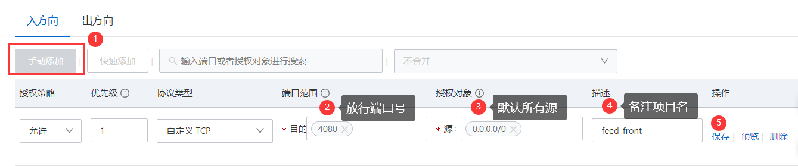  
  `宝塔面板`放行：    
            
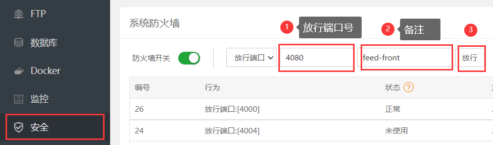    
          
- 将后端项目进行打包部署。在项目根目录下执行`tsc`命令，将生成 `dist` 目录，在服务器中新建目录（如 `feed-server`），然后将根目录下除`src`和`node_modules`目录的所有文件（`.vscode`实际也不需要）拷贝至该目录中，如图：       
        
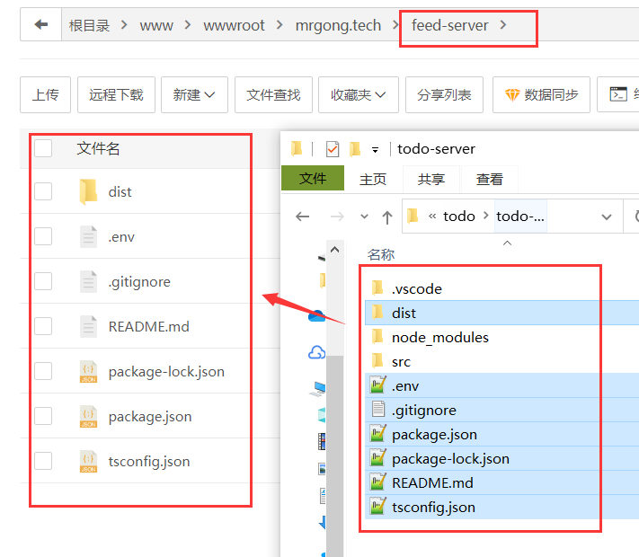
      
- 在该目录下新建终端，执行`npm install`安装项目依赖    
- 打开 PM2 管理器（软件商店下载），按照如下方式添加项目：   
      
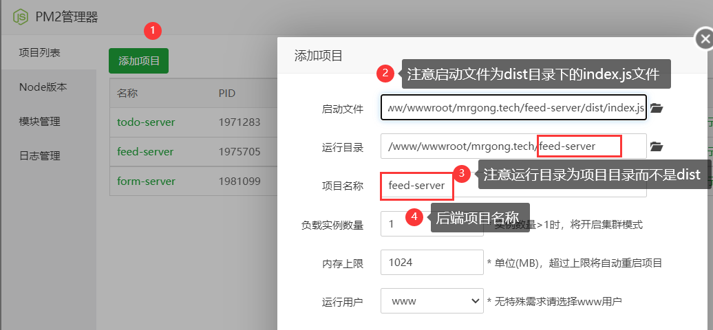

- 至此，该项目的所有接口已经可以正常请求了    
         
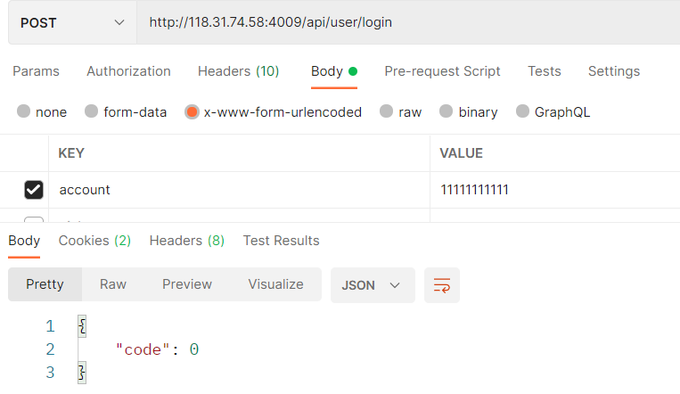    
                 
### 二.前端项目部署

- 放行前端项目端口，方法同上。   
      
- 将项目进行打包部署。在项目根目录下执行 `npm run build`，在服务器中新建目录（如 `feed-front`），然后将 `build` 目录的所有文件拷贝至该目录中。   
        
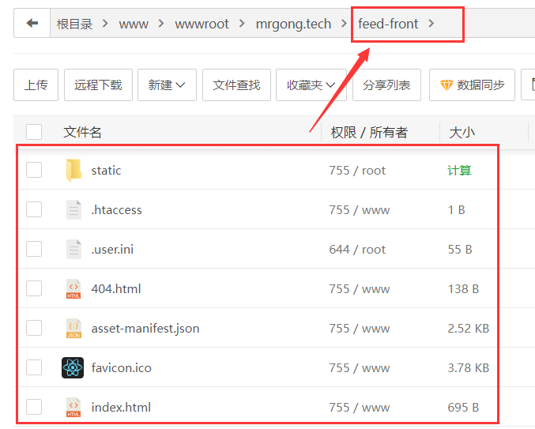  
                   
- （如果想通过域名访问，可以在阿里云控制台域名解析中添加子域名，如图）   
          
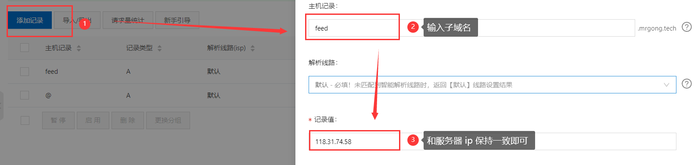 

- 在`宝塔面板-网站`中按照以下方式添加 PHP 项目：   
      
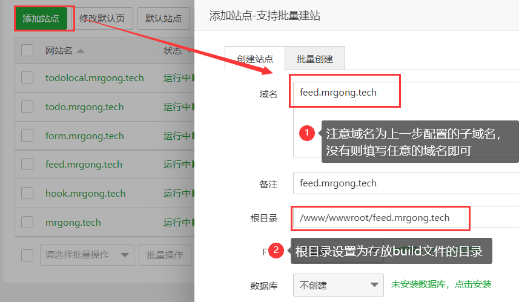    

- 点击`设置-域名管理`，添加 `IP:PORT` 后，删除原来的域名（若上一步配置的是自己的子域名，该步请忽略）        
        
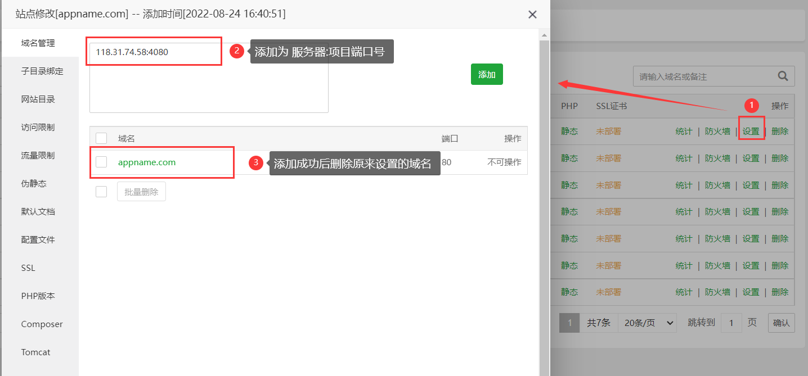   
       
- 在配置文件中添加以下配置,其中，`proxy_pass`属性修改成后端的端口号，`root`属性修改成存放`build`文件的目录，如图：

```
location /api/ {
  proxy_set_header X-Forwarded-For $proxy_add_x_forwarded_for;
  proxy_set_header X-Real-IP $remote_addr;
  proxy_pass http://127.0.0.1:4060;
}
location / {
  root /www/wwwroot/mrgong.tech/feed-front;
  try_files $uri $uri/ /index.html;
}
```
          
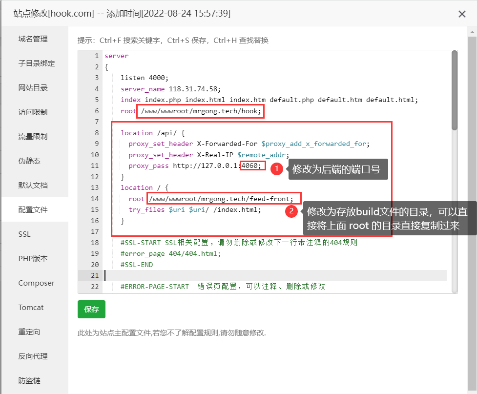      
       
- 至此，项目已经可以通过地址 `IP:PORT`或者子域名的方式访问了                 
                  
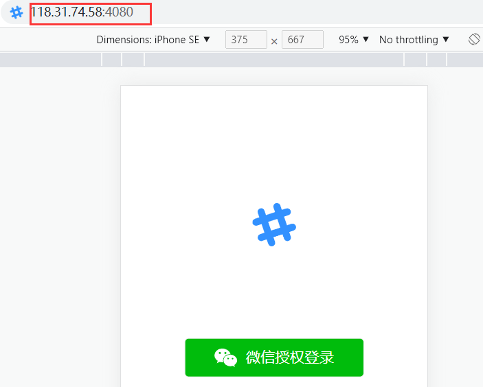 
 
       
> 纯前端项目部署:在服务器安全组以及宝塔安全面板放行相应端口号之后，直接在本地目录下运行 `npm run build` ，然后将 `build` 目录的文件拷贝至服务器，新建 PHP 项目，添加 `IP:PORT` 后删除域名，就能够正常访问了